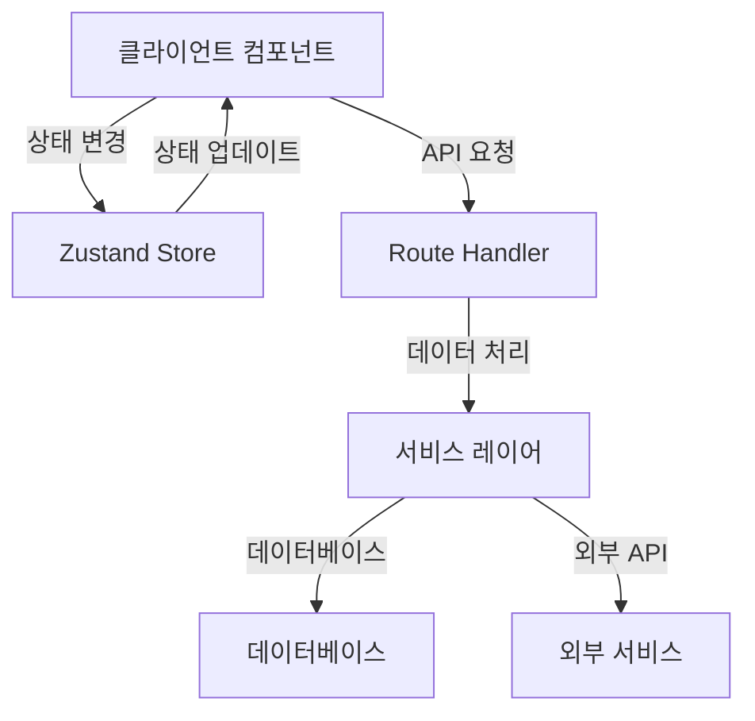

# Ovis AI 에이전트 시스템 아키텍처

## 1. 시스템 개요

Ovis AI 에이전트 시스템은 Next.js 15를 기반으로 한 현대적인 웹 애플리케이션입니다. App Router를 활용하여 서버 컴포넌트와 클라이언트 컴포넌트를 명확히 분리하고, TailwindCSS와 shadcn/ui를 사용하여 모던한 UI를 구현합니다.

## 2. 핵심 아키텍처 원칙

### 2.1 컴포넌트 아키텍처
- **서버 컴포넌트 우선**: 기본적으로 모든 컴포넌트는 서버 컴포넌트로 구현
- **클라이언트 컴포넌트**: 상호작용이 필요한 경우에만 'use client' 지시문 사용
- **컴포넌트 계층 구조**:
  ```
  app/
  ├── layout.tsx (서버 컴포넌트)
  ├── page.tsx (서버 컴포넌트)
  └── components/
      ├── ui/ (shadcn/ui 컴포넌트)
      └── features/ (도메인별 컴포넌트)
  ```

### 2.2 상태 관리
- **Zustand**: 전역 상태 관리
- **React Context**: 테마, 인증 등 앱 전반의 상태
- **서버 상태**: React Query (TanStack Query) 사용

### 2.3 API 아키텍처
- **Route Handlers**: /app/api 디렉토리에서 API 엔드포인트 정의
- **서버 액션**: 폼 제출 등 간단한 데이터 처리
- **API 응답 형식**:
  ```typescript
  interface IApiResponse<T> {
    success: boolean;
    data?: T;
    error?: string;
  }
  ```

## 3. 데이터 흐름



## 4. 보안 아키텍처

- **인증**: Clerk을 사용한 JWT 기반 인증
- **인가**: 미들웨어를 통한 라우트 보호
- **API 보안**: Rate Limiting, CORS 설정

## 5. 성능 최적화

- **이미지 최적화**: Next.js Image 컴포넌트 사용
- **코드 분할**: 동적 임포트 활용
- **캐싱 전략**: 
  - 서버 컴포넌트 캐싱
  - API 응답 캐싱
  - 정적 자산 캐싱

## 6. 배포 아키텍처

- **Vercel 배포**: 자동화된 CI/CD 파이프라인
- **환경 변수 관리**: Vercel 환경 변수 사용
- **모니터링**: Vercel Analytics 활용

## 7. 확장성 고려사항

- **마이크로서비스 준비**: API 엔드포인트 모듈화
- **데이터베이스 스케일링**: Drizzle ORM 사용
- **캐싱 계층**: Redis 도입 가능성 고려 